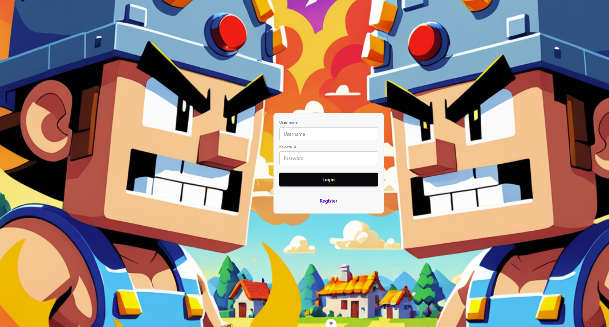
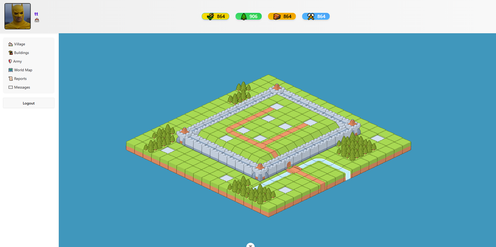

# VILLAGE VANDALS

--- 
## Village builder game built with:
 * [PixiJS](https://pixijs.com/) - Sprite/tile application container
 * [VueJS](https://vuejs.org/) - Frontend framework
 * [Spring Boot](https://spring.io/projects/spring-boot) - Backend framework
 * [PostgreSQL](https://www.postgresql.org/) - Database

--- 
### Login screen

The login screen is a basic view that uses a component from the [DaisyUI](https://daisyui.com/) library.

You can either log in with your credentials or register a new account.

After a successful login, a JWT (JSON Web Token) will be sent in the response.

---

### In-Game View

After signing in, you will be redirected to your village view. The village is displayed as a rendered tilemap.

At the top, you will find a bar showing your resources:
- 🌾 Food
- 🌲 Lumber
- 🧱 Bricks
- ⚒️ Iron

These resources are essential for developing and growing your village over time.

The grey squares in the village represent construction sites.  
Interacting with a construction site will open the building menu, where you can spend resources to construct buildings.  
Some buildings will increase the production rate of different resources.

On the left side of the screen, you will find a navigation bar.

Used resources:  
Farmer  
<a href="https://www.flaticon.com/free-icons/farmer" title="farmer icons">Farmer icons created by Amethyst prime - Flaticon</a>  
LumberMill 
  <a href="https://www.flaticon.com/free-icons/wood" title="wood icons">Wood icons created by imaginationlol - Flaticon</a>
