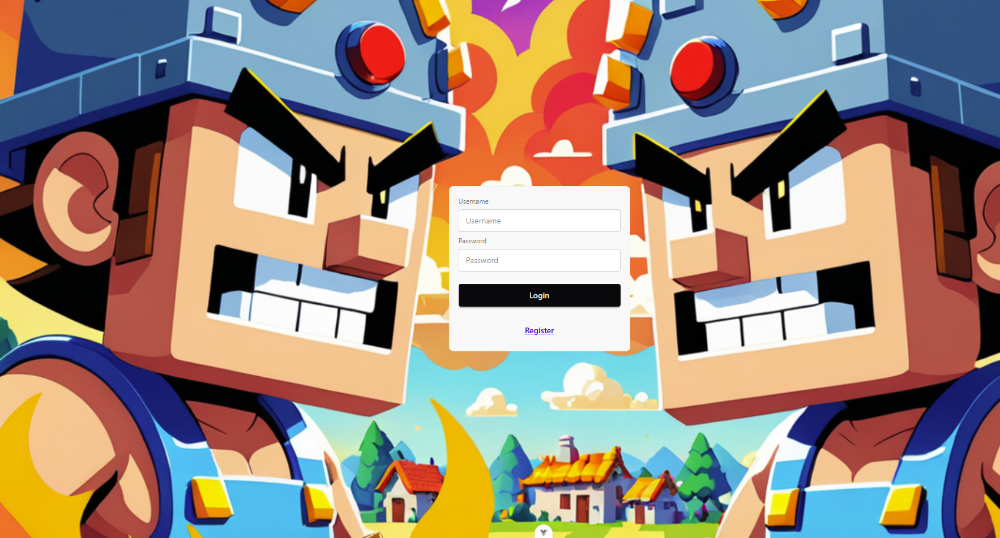
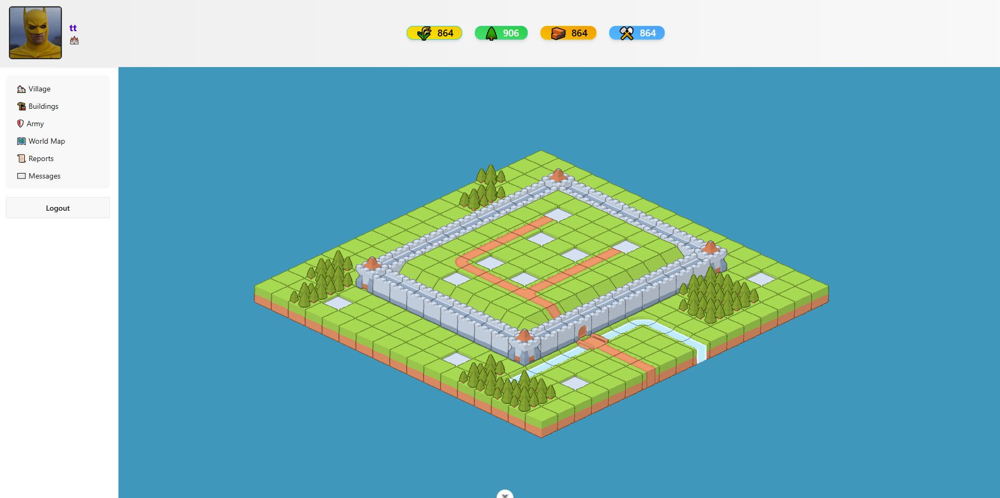

# VILLAGE VANDALS

--- 
## Village builder game built with:
 * [PixiJS](https://pixijs.com/) - Sprite/tile application container
 * [VueJS](https://vuejs.org/) - Frontend framework
 * [Spring Boot](https://spring.io/projects/spring-boot) - Backend framework
 * [PostgreSQL](https://www.postgresql.org/) - Database

---
## Setup

### Environment variables

The project uses a `.env` file at the repository root to supply secrets to Docker Compose and the backend. This file is listed in `.gitignore` and is never committed.

Copy the example file and fill in your values:

```bash
cp .env.example .env
```

| Variable | Description |
|---|---|
| `DB_PASSWORD` | Password for the PostgreSQL database |
| `SECRET` | JWT signing secret — must be at least 32 characters |
| `KEYCLOAK_ADMIN_PASSWORD` | Password for the Keycloak `admin` user |
| `KEYCLOAK_CLIENT_ID` | Keycloak client ID used by the backend (`backend-service` by default) |
| `KEYCLOAK_CLIENT_SECRET` | Keycloak client secret for the backend client |

Example `.env` for local development:

```env
DB_PASSWORD=change_me
SECRET=change_me_to_a_long_random_string_at_least_32_chars
KEYCLOAK_ADMIN_PASSWORD=change_me
KEYCLOAK_CLIENT_ID=backend-service
KEYCLOAK_CLIENT_SECRET=change_me
```

Docker Compose reads `.env` automatically — no extra steps required once the file exists.

### Running with Docker

```bash
docker compose up
```

Starts PostgreSQL, the Spring Boot backend (port 8081), the Vue/Nginx frontend (port 80), and Keycloak (port 8080).

### Running locally (without Docker)

**Backend** — requires Java 21:

```bash
mvn clean package   # build
mvn test            # run tests
```

Export the variables from `.env` in your shell or configure them in your IDE run configuration before starting the app.

**Frontend:**

```bash
cd frontend
npm install
npm run dev   # Vite dev server → http://localhost:5173
```

The frontend reads `VITE_API_BASE_URL` from `frontend/.env` (defaults to `http://localhost:8081`).

--- 
### Login screen

The login screen is a basic view that uses a component from the [DaisyUI](https://daisyui.com/) library.

You can either log in with your credentials or register a new account.

After a successful login, a JWT (JSON Web Token) will be sent in the response.




---

### In-Game View

After signing in, you will be redirected to your village view. The village is displayed as a rendered tilemap.

At the top, you will find a bar showing your resources:
- 🌾 Food
- 🌲 Lumber
- 🧱 Bricks
- ⚒️ Iron

These resources are essential for developing and growing your village over time.

The grey squares in the village represent construction sites.  
Interacting with a construction site will open the building menu, where you can spend resources to construct buildings.  
Some buildings will increase the production rate of different resources.

On the left side of the screen, you will find a navigation bar.



Used resources: <br>
Farmer <br>
<a href="https://www.flaticon.com/free-icons/farmer" title="farmer icons">Farmer icons created by Amethyst prime - Flaticon</a> <br>
LumberMill 
<br> <a href="https://www.flaticon.com/free-icons/wood" title="wood icons">Wood icons created by imaginationlol - Flaticon</a><br>
Buildings
<br>
<a href="http://www.freepik.com">Designed by macrovector / Freepik</a><br>
<a href="https://www.flaticon.com/free-icons/military" title="military icons">Military icons created by Umeicon - Flaticon</a><br>
<a href="https://www.flaticon.com/free-icons/bricks" title="bricks icons">Bricks icons created by cah nggunung - Flaticon</a>